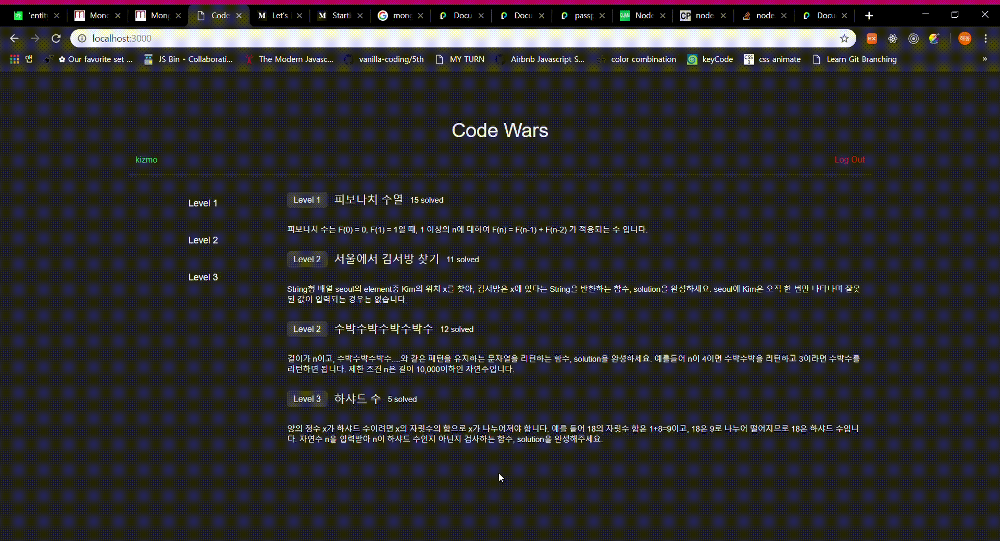

# vanilla-codewars

등록되어 있는 알고리즘 문제를 풀 수 있는 어플리케이션입니다.


<br />



### Set up

  - `npm install`
  
## Development

```sh
npm run dev
```

## Features

* [NodeJS](https://nodejs.org/api/)
* [Express](https://expressjs.com/)
* [Mongoose](http://mongoosejs.com/)

## Challenges and Things to do

* 문제를 등록할 수 있는 기능도 구현해 보자.

* passport js를 사용해 보았지만 자세한 공부를 더 해야할 듯 하다.
* SQL과 NoSQL의 차이점에 대해서 공부해야겠다.
* schema design에 대한 공부도 더 필요하다.
